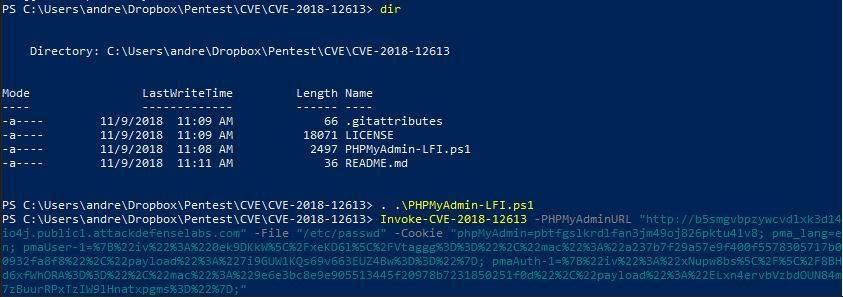
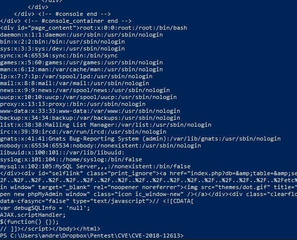

# CVE-2018-12613
Local file inclusion bug due to filter bypass using %253f character.

# Software Affected
1. PHPMyAdmin v.4.8.0
2. PHPMyAdmin v.4.8.1

# How to use
This PowerShell scripts need three parameters to craft a exploit HTTP request:

    1. PHPMyAdmin URL endpoint
    2. Cookies for an authenticated user
    3. A full path file to be retrieved in remote server

# Example

Prepare all the parameters to use the script:

Then, after you run it:

# Remote Code Execution

This could lead to remote code execution if you query a SELECT SQL containing PHP code. Then you can include your session file in /var/lib/php/sessions/SESSION_ID_HERE file to execute arbitrary PHP code.

I haven't coded a Code execution PoC. But you can do it manually and trigger it with this code.